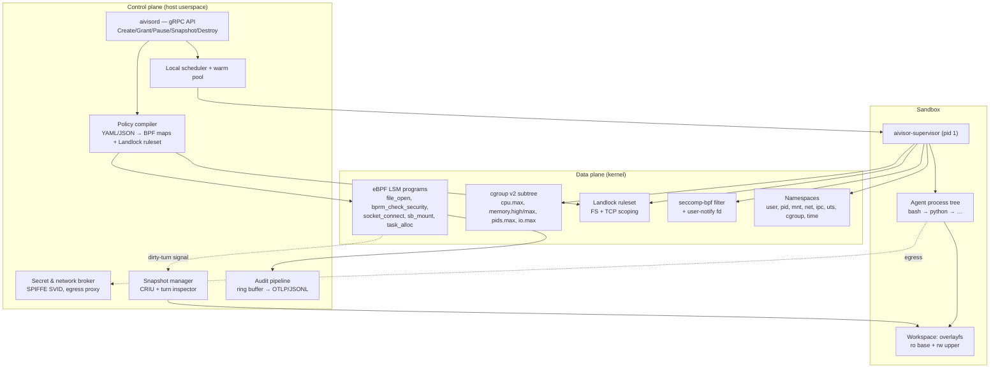
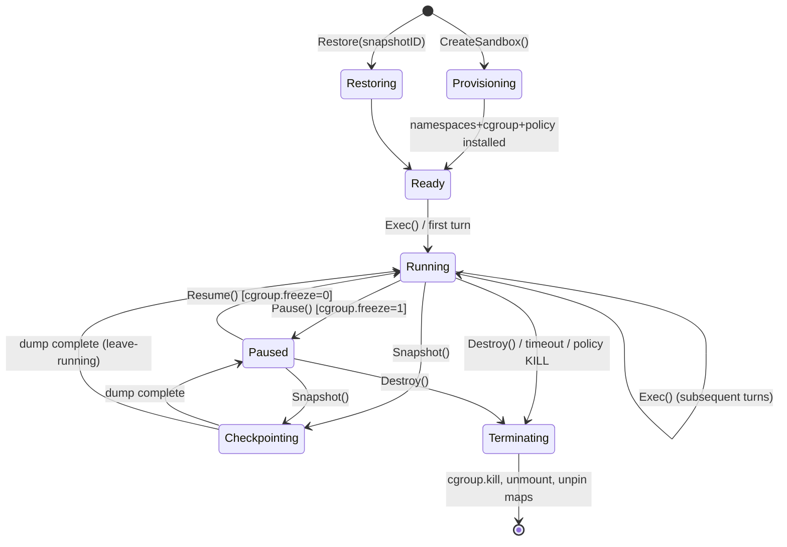
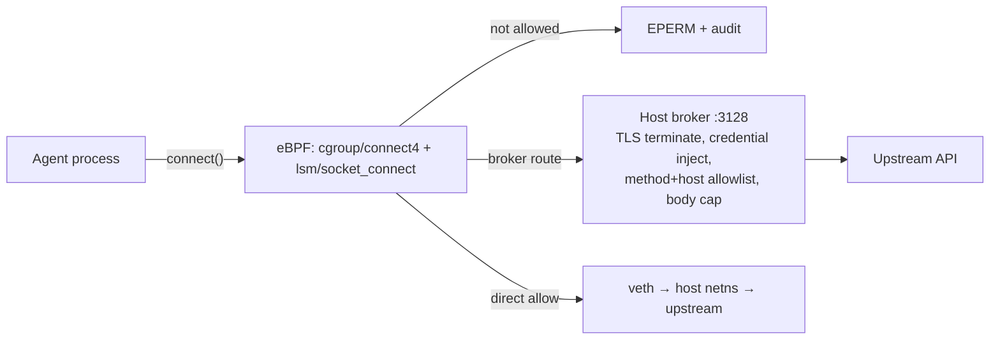
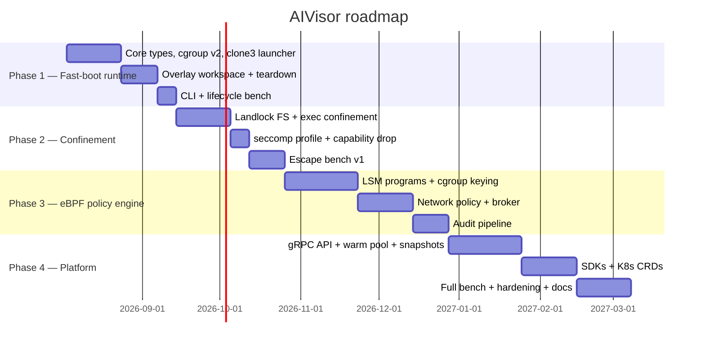

# AIVisor — Architecture Blueprint

**Status:** Draft v0.1 (normative for Phases 1–4)
**Audience:** Implementers (human and model), reviewers, integrators
**Repo license:** MIT (see `LICENSE`). *Open governance question: relicense to Apache-2.0 before v1.0 for patent-grant parity with Firecracker/Kata/gVisor. Decide before first external contribution.*

---

## 0. How to read this document

This blueprint is the **single source of truth** for what AIVisor is. Everything else in the
repo derives from it:

| File | Purpose |
| --- | --- |
| `blueprint.md` | This document. Architecture, invariants, API, threat model. |
| `roadmap.md` | Phase-by-phase build breakdown (tasks, DoD, common failure modes, handoff markers) and the AI-assisted implementation workflow. |
| `CLAUDE.md` | Repo conventions any coding agent must load. |

Earlier drafts of this project planned a `phase1.md`…`phase4.md` split and a `prompts/` directory
of ready-to-paste session prompts; neither exists in this repo today. `roadmap.md` is what
actually carries that content. Do not assume `prompts/` or `phaseN.md` exist without checking —
a prior version of this document and of `CLAUDE.md` referenced them as if they did, which is
exactly the kind of stale, unverifiable pointer this project's own conventions (§0, this
section) exist to prevent.

**Normative language.** MUST / MUST NOT / SHOULD / MAY are used per RFC 2119. A phase is
"done" only when every MUST in its acceptance criteria is demonstrated by a test in CI.

**Provenance note.** §2 (industry landscape) and §3 (research survey) summarise an external
research brief supplied by the project sponsor. Figures such as "5–16 ms snapshot resume" or
"56–74 % of agent latency is OS-side" are **carried from that brief and are not independently
verified in this repo**. They are directionally useful for prioritisation. Do **not** cite them
in external marketing, papers, or the README until re-verified against primary sources. Every
performance number AIVisor itself claims MUST come from `bench/` running in CI (§13).

---

## 1. Executive summary

AIVisor is a **lightweight, eBPF-driven sandbox runtime for autonomous AI agents**. It composes
existing Linux primitives — namespaces, cgroup v2, Landlock LSM, eBPF LSM, seccomp — into a
per-agent execution context that starts in single-digit milliseconds cold and sub-millisecond
warm, enforces policy *inside the kernel*, and streams a complete audit trail of what the agent
touched.

The design bet, stated plainly:

> Full microVMs give strong isolation but pay a guest kernel in both boot time and memory, and
> they are opaque — you cannot see what the agent did without instrumenting inside the guest.
> Syscall-emulating sandboxes (gVisor) trade compatibility and speed for isolation. Plain
> containers are neither fast enough to be disposable per-turn nor observable enough to be
> trusted. AIVisor takes the third path: **run on the host kernel, drop privileges aggressively,
> and enforce in-kernel with eBPF LSM keyed to the agent's cgroup.**

The cost of that bet, also stated plainly: **AIVisor's isolation boundary is the host kernel.**
A kernel LSM/namespace escape is a full compromise, where in Firecracker it would still face
the KVM boundary. AIVisor is therefore positioned for **same-trust-domain multi-agent density**
(one tenant, many agents; CI; internal platforms) and as a **defence-in-depth layer inside** a
microVM for hostile multi-tenancy. §11 makes this explicit and §11.6 defines the nested
deployment mode. Any documentation that implies AIVisor replaces hardware isolation for
hostile multi-tenant workloads is a bug.

### What "gold standard" means here, concretely

1. **Fast enough to be per-turn disposable.** Warm-pool acquire p50 < 1 ms, cold create p50
   < 10 ms for a shell, < 40 ms for a Python interpreter.
2. **Deny-by-default on filesystem, network, and exec** — with policy authored once and
   enforced by the kernel, not by a cooperating library the agent can bypass.
3. **Every decision auditable.** Every allow and deny is an event with agent ID, cgroup ID,
   turn ID, and the kernel object involved.
4. **State that survives a turn.** Overlay workspace plus turn-aware checkpointing that skips
   the ~75 % of turns which change nothing on disk.
5. **No secret ever enters the sandbox.** Credentials terminate at a host-side broker.
6. **Portable.** OCI images in, gRPC out, K8s CRD optional, no vendor lock.

---

## 2. Industry landscape (from sponsor brief — unverified, see §0)

| Offering | Isolation | Claimed start | Notable property |
| --- | --- | --- | --- |
| AWS Lambda MicroVMs | Firecracker | 5–16 ms from snapshot | Per-session stateful microVM, memory+disk retained for session |
| Azure Container Apps Sandboxes (preview) | Firecracker | sub-second | Same substrate as GitHub Copilot sandboxes |
| Google GKE Agent Sandbox (GA) | gVisor / Kata, pluggable | ~200 ms p90 | K8s-native CRD, CRIU pod snapshot, warm pools |
| Google Agent Substrate (OSS) | scheduling layer only | — | Pushes agents onto pre-provisioned compute, bypasses full control-plane cost |
| K8s SIG Apps Agent Sandbox | gVisor / Kata | — | Singleton stateful pod, scale-to-zero, WarmPool extension planned |
| E2B, Docker Sandboxes, Alibaba OpenSandbox | Firecracker / ns+microVM / multi-runtime | varies | Mostly managed or proprietary |

**Reading of the landscape.** Everyone has converged on the same four requirements — *fast
start, stateful across turns, strong isolation, per-sandbox egress control*. Nobody in the list
has converged on **in-kernel observability and policy**. That is the gap AIVisor targets. The
secondary gap is **density**: a guest kernel per agent caps you in the low hundreds per host;
AIVisor's per-agent cost is a process tree plus a few BPF map entries.

---

## 3. Research inputs and what we take from each (from sponsor brief — unverified)

| Work | Core finding | What AIVisor adopts | What we do *not* adopt |
| --- | --- | --- | --- |
| **AgentCgroup** (Feb 2026) | 56–74 % of agent latency is OS/tool execution, not inference; memory spikes ~15× across tool calls; coarse cgroups mis-serve this | Turn-aligned cgroup subtrees; `memory.high` throttling ahead of `memory.max` kills; reactive limits driven from userspace on turn boundaries | `sched_ext` custom schedulers — too kernel-version-fragile for v1; revisit Phase 5 |
| **Crab** (Apr 2026) | ~75 % of agent turns produce no OS-visible state change; blanket checkpointing is waste | eBPF turn inspector that marks a turn dirty on write/mkdir/unlink/exec; checkpoint only dirty turns; overlap checkpoint with LLM think time | Its specific CRIU integration; we wrap CRIU behind a trait so it can be swapped |
| **Sandlock** (ASPLOS'26 wksp) | Landlock (static invariants) + seccomp user-notify (dynamic decisions) sandboxes agents unprivileged, ~5 ms overhead | The split itself: static path rules in Landlock, dynamic decisions escalated to a userspace supervisor | Process-only scope — AIVisor adds namespaces so multi-process agent trees are covered |
| **ActPlane** (Jun 2026) | Intent-level policy DSL compiled to eBPF LSM; block/kill/notify; children cannot weaken inherited constraints | The monotonic-narrowing invariant (§8.4) and block/kill/notify verbs | The full DSL and its compiler in v1 — we ship a declarative policy schema and add expressive rules later |
| **SandboxEscapeBench** (Mar 2026) | Capable LLMs reliably exploit known container misconfigurations | Escape scenarios become a CI gate, not a one-off audit | — |

---

## 4. Workload model — what an AI agent actually does to an OS

This section is the *why* behind every design choice. Implementers should re-read it whenever a
tradeoff is unclear.

**W1 — Turn-structured and bursty.** An agent alternates: think (LLM inference, 1–30 s, zero
syscalls) → act (tool calls, 10 ms–10 s, syscall storm) → repeat. Consequences: (a) idle windows
are free real estate for checkpointing and for releasing resource reservations; (b) monitoring
cost is concentrated in short bursts, so per-syscall overhead matters more than steady-state
overhead; (c) a sandbox that must exist for the whole session but is idle 80 % of it needs
*cheap idleness*, which rules out a guest kernel per agent.

**W2 — Memory-dominant and spiky.** CPU is rarely the binding constraint; a `pip install`, a
test suite, or a build blows memory by an order of magnitude for seconds. Hard `memory.max`
alone produces OOM kills mid-turn, which agents handle badly (they retry, amplifying). Design:
`memory.high` for backpressure, `memory.max` as the real wall, PSI pressure exported to the
scheduler, and OOM events surfaced as structured errors the orchestrator can show the model.

**W3 — Deep process trees.** One turn can be `bash → python → pip → gcc → ld`, plus background
daemons (language servers, dev servers). Every confinement MUST be inherited, unconditionally,
by every descendant. This is why Landlock (inherited, unrevokable) and cgroup-keyed BPF LSM
(inherited by cgroup membership) are the enforcement substrate, and why anything based on
"the runtime asks nicely" is rejected.

**W4 — Stateful across turns.** `/workspace` must survive turn boundaries: files edited,
packages installed, caches warmed. Stateless per-call containers are a category error for
agents.

**W5 — Network is the primary exfiltration and injection channel.** Agents fetch docs, call
APIs, `pip install` from registries. Destinations are *prompt-derived*, so a static allowlist is
simultaneously too tight (breaks legitimate work) and too loose (a compromised agent reaches
anything on the list). Design: deny-by-default egress, a host-side HTTP(S) broker for anything
policy-approved, DNS pinning to defeat rebinding, and cloud metadata endpoints blocked
unconditionally unless explicitly capability-granted.

**W6 — Credentials must never be in-sandbox.** A prompt-injected agent will read every env var
and every file it can. The only robust answer is that the secret is not there to read: the
broker holds it, the agent holds a short-lived identity, and the broker attaches the credential
on the way out.

**W7 — Density.** Platforms will run 10²–10³ agents per host. Per-agent fixed cost is the
headline metric: target < 8 MB RSS for an idle sandbox exclusive of the agent's own workload.

---

## 5. System architecture

### 5.1 Components



### 5.2 The five enforcement layers

Each layer is independent. Breaching one does not breach the next. Layers are listed in the
order they are applied at sandbox creation.

| # | Layer | Applied by | Revocable by agent? | Covers |
| --- | --- | --- | --- | --- |
| L1 | Namespaces | parent, at `clone3()` | No | Process/FS/net/IPC visibility |
| L2 | cgroup v2 | parent, before exec | No | CPU, memory, PIDs, IO, freeze, kill |
| L3 | Landlock | **child, self-applied** | No (kernel-enforced monotonic) | FS paths, TCP bind/connect ports, IPC scoping |
| L4 | seccomp-bpf | child, self-applied | No (`no_new_privs`) | Syscall surface reduction, user-notify escalation |
| L5 | eBPF LSM | control plane, cgroup-keyed | No (agent cannot load BPF) | Kernel-object-level allow/deny + audit |

**L3 and L4 are self-applied and this is not optional.** Landlock and seccomp can only be
installed by the task on itself. The launch sequence in §6.2 exists precisely because of this
constraint; getting the ordering wrong is the single most likely correctness bug in Phase 2.

### 5.3 Why eBPF LSM rather than seccomp for the security-critical checks

seccomp filters see **syscall arguments as raw user pointers**. It cannot dereference a `char*`
path safely, so path-based decisions in seccomp are TOCTOU-vulnerable: the agent passes an
allowed path, the filter approves, then another thread swaps the path via symlink before the
kernel resolves it. eBPF LSM hooks fire **after** the kernel has resolved the object — you get
a `struct file*`, a `struct sockaddr*` already copied in, a `struct linux_binprm*`. There is no
window to swap it.

seccomp is still used (L4) as a **surface reducer** — killing whole syscall families the agent
has no business calling (`kexec_load`, `bpf`, `perf_event_open`, `userfaultfd`, `ptrace`, module
ops) — where the decision needs no argument dereference. That is what seccomp is good at.

---

## 6. Sandbox lifecycle

### 6.1 States



**Invariants.**
- A sandbox in any state other than `Terminating`/`[*]` holds exactly one cgroup, one mount
  namespace, and one entry in every per-sandbox BPF map.
- `Terminating` MUST be idempotent and MUST complete even if the agent tree is wedged
  (`cgroup.kill` = 1 guarantees this on kernels ≥ 5.14).
- Resources are reclaimed in the reverse order they were acquired. BPF map entries are deleted
  **last**, so that a racing syscall from a dying process is still denied rather than
  unmatched-and-allowed. **Map miss MUST fail closed** (§8.3).

### 6.2 Launch sequence (normative — implement exactly this order)

```
Parent (aivisord / aivisor-supervisor host side)
 1. Allocate sandbox_id (UUIDv7). Create cgroup /sys/fs/cgroup/aivisor/<id>/
 2. Write cgroup limits: cpu.max, memory.high, memory.max, pids.max, io.max
 3. Compile policy → per-sandbox BPF map entries, keyed by cgroup_id (NOT pid)
    3a. Insert DENY-ALL sentinel first, then narrow. Never a window where the id is absent.
 4. Prepare rootfs: mount ro base (OCI image, squashfs or dir) + tmpfs upper → overlayfs
 5. clone3(CLONE_NEWUSER|NEWPID|NEWNS|NEWNET|NEWIPC|NEWUTS|NEWCGROUP|NEWTIME,
           cgroup = the cgroup fd  [CLONE_INTO_CGROUP, ≥5.7])
 6. Parent writes uid_map/gid_map/setgroups for the child's user namespace
 7. Parent signals child "userns ready" over a socketpair

Child (becomes pid 1 in the new pid namespace = aivisor-supervisor)
 8. Wait for "userns ready"
 9. prctl(PR_SET_NO_NEW_PRIVS, 1)          ← MUST precede 10 and 11
10. pivot_root into overlay; mount /proc, /sys (ro), /dev (minimal devtmpfs subset)
11. Drop capability bounding set to empty; clear ambient/inheritable
12. Apply Landlock ruleset (FS + net if ABI ≥ 4) and restrict_self()
13. Install seccomp-bpf filter (+ user-notify fd handed back to parent via SCM_RIGHTS)
14. setresuid/gid to the unprivileged in-namespace user
15. execve(agent entrypoint)
```

**Ordering rules that MUST NOT be violated:**
- `no_new_privs` before Landlock and before seccomp — both reject the call otherwise for
  unprivileged callers.
- Landlock before `pivot_root`? **No** — after. Landlock rules are resolved against the mount
  namespace at ruleset-creation time; create the ruleset with file descriptors opened *inside*
  the final mount namespace.
- seccomp last of the self-restrictions, because installing a filter may block the very syscalls
  (`landlock_*`, `mount`, `pivot_root`) used above it.
- `CLONE_INTO_CGROUP` avoids the classic race where the child runs briefly outside its cgroup —
  which would mean **running briefly outside its eBPF LSM policy**. If the kernel lacks it, the
  parent MUST write to `cgroup.procs` *and* the child MUST block on the socketpair until the
  parent confirms membership. Do not skip this.

### 6.3 Warm pool (how sub-millisecond is actually achieved)

Cold path cannot be sub-millisecond — `clone3` with seven namespaces, an overlay mount, a
Landlock ruleset install and a map population is 3–10 ms of honest work. Sub-millisecond comes
from **pre-paying that cost**:

- Each node keeps N pre-built sandboxes per `SandboxTemplate` in state `Ready`: namespaces
  created, overlay mounted, supervisor parked in a blocking read, policy maps holding a
  *deny-all* placeholder entry.
- `CreateSandbox` with a matching template = pop from pool + swap the map entries from
  placeholder to the real policy + hand the caller the sandbox ID. Target < 1 ms.
- Pool refill happens asynchronously off the request path.
- **Security rule:** a pooled sandbox is single-use. It is never returned to the pool after an
  agent has run in it. Reuse would leak workspace and process state across trust boundaries.
- The placeholder policy MUST be deny-all, so a bug in the swap fails closed.

### 6.4 Zygote (optional, Phase 4+)

For interpreter-heavy workloads, a pooled sandbox may pre-import a Python zygote and block
before the first user code. `fork()` from the zygote skips interpreter startup (~25 ms). The
zygote MUST be forked *before* any tenant data is present, and the fork inherits Landlock and
seccomp automatically.

---

## 7. Storage and workspace

```
/            ← overlayfs (upper=tmpfs or per-sandbox dir, lower=OCI base image, ro)
/workspace   ← the agent's writable working directory (part of upper, or its own mount)
/tmp         ← tmpfs, size-capped, noexec unless ToolCap grants exec
/proc        ← procfs, hidepid=2, subset=pid
/sys         ← ro, with /sys/fs/cgroup NOT mounted (agent must not see or edit its own limits)
/dev         ← null, zero, full, random, urandom, tty, ptmx only. No /dev/kmsg, no loop, no fuse.
```

**Rules.**
- Base image layers are shared read-only across all sandboxes from the same template — this is
  the density lever. One page cache copy of Python serves 500 agents.
- Upper layer is tmpfs by default (fast, and teardown is a single unmount). Templates may
  request a disk-backed upper for large workspaces; the size limit is then enforced by
  project quota or a loop-mounted image, not by hope.
- `noexec,nosuid,nodev` on every writable mount unless a `ToolCap` explicitly needs exec from
  the workspace (agents that compile and run their own binaries). When granted, exec from
  workspace is still subject to L5 `bprm_check_security`.
- Snapshotting a workspace = archiving the upper layer only.

---

## 8. Policy and capability model

### 8.1 Capability types

| Capability | Grants | Enforced at |
| --- | --- | --- |
| `ToolCap` | Exec a specific binary path or path prefix | L3 (`LANDLOCK_ACCESS_FS_EXECUTE`) + L5 (`bprm_check_security`, hash-pinned) |
| `FileCap` | Read / write / create / delete under a path | L3 (Landlock FS rules) + L5 (`file_open`) |
| `NetCap` | Egress to a host/CIDR/port set, or "via broker only" | L5 (`socket_connect` + `cgroup/connect4|6`) + broker |
| `IdentityCap` | A SPIFFE SVID with a given set of audiences | Broker; SVID never written into the sandbox FS |
| `ResourceCap` | CPU/memory/PID/IO ceilings above template default | L2 |
| `DeviceCap` | Access to a device node (e.g. `/dev/nvidia*` for GPU) | L1 (device cgroup / mount) + L5 |
| `SnapshotCap` | Whether the agent may request its own checkpoint | Control plane |

### 8.2 Policy document (canonical form)

```yaml
apiVersion: aivisor/v1
kind: SandboxPolicy
metadata:
  name: coding-agent-default
spec:
  filesystem:
    default: deny
    rules:
      - path: /workspace           # agent's own scratch
        access: [read, write, create, delete, truncate]
      - path: /usr                 # base image
        access: [read, execute]
      - path: /tmp
        access: [read, write, create, delete]
      - path: /etc/ssl/certs
        access: [read]
  exec:
    default: deny
    allow:
      - path: /usr/bin/python3
        pin: sha256:…              # optional; L5 verifies inode+hash on first exec
      - path: /usr/bin/bash
      - prefix: /usr/lib/python3.12/
  network:
    default: deny
    egress:
      - via: broker                # HTTP(S) through host proxy, TLS terminated by broker
        hosts: ["pypi.org", "files.pythonhosted.org", "github.com"]
        methods: [GET]
      - direct:                    # rare; raw TCP
        cidr: 10.42.0.0/16
        ports: [5432]
    blockMetadata: true            # 169.254.169.254, fd00:ec2::254, metadata.google.internal
    dnsPolicy: broker-pinned       # broker resolves + pins IP for the connection lifetime
  resources:
    cpu: "2"
    memoryHigh: 1Gi
    memoryMax: 2Gi
    pids: 512
    ioMax: "8:0 rbps=104857600 wbps=52428800"
  runtime:
    seccompProfile: aivisor-default
    landlockAbiMin: 3
    timeout: 30m
    maxIdle: 10m
  audit:
    level: allow+deny              # deny-only | allow+deny | full
    sink: otlp
```

### 8.3 Compilation to enforcement

The policy compiler emits three artefacts:

1. **Landlock ruleset** — filesystem paths and (ABI ≥ 4) TCP port sets. Applied by the child.
   This is the *static, unrevokable floor*. If Landlock alone would be sufficient for a rule,
   it goes in Landlock; eBPF is for what Landlock cannot express.
2. **BPF map entries** — keyed by **cgroup ID**, not PID. PIDs are reused and racy; cgroup ID is
   stable for the sandbox lifetime and is what `bpf_get_current_cgroup_id()` /
   `bpf_current_task_under_cgroup()` give you inside an LSM hook.
3. **seccomp filter** — a fixed profile plus per-policy deltas.

**Critical implementation note for L5.** eBPF LSM programs are **global**, not per-cgroup. A
single `lsm/file_open` program runs for every `open` on the host, including the host's own
daemons. Therefore every AIVisor LSM program MUST begin with:

```c
u64 cgid = bpf_get_current_cgroup_id();
struct sandbox_ctx *ctx = bpf_map_lookup_elem(&sandboxes, &cgid);
if (!ctx)
    return 0;            /* not an AIVisor sandbox — do not interfere with the host */
```

…and after that point, **every unmatched case MUST deny** (`return -EPERM`), not allow. Getting
this backwards — fail-open inside the sandbox, or fail-closed outside it — is respectively a
security hole and a host outage. Both have happened in real projects. There is a mandatory CI
test for each direction (`bpf_no_host_interference`, `bpf_unmatched_denies`).

Note also that a sandbox's cgroup ID may need to match a *subtree*; use
`bpf_current_task_under_cgroup()` against a `BPF_MAP_TYPE_CGROUP_ARRAY` when nested cgroups are
in play (turn-scoped subtrees, §10.2).

### 8.4 Monotonic narrowing (the inheritance invariant)

> **Invariant M.** A sandbox's effective privilege set may only shrink over its lifetime, except
> through an explicit `GrantCapability` call from the control plane, which is authenticated and
> audited. No action taken *by the agent* may widen it, directly or transitively.

This holds by construction: Landlock rulesets compose by intersection and cannot be removed;
`no_new_privs` blocks setuid escalation; the agent has no `CAP_BPF` so cannot touch the maps;
the agent cannot see `/sys/fs/cgroup` so cannot raise its own limits. Any feature proposal that
violates M is rejected regardless of convenience.

### 8.5 Dynamic decisions

Some decisions cannot be pre-declared (a prompt-derived URL, a first-time exec). Three verbs:

- **BLOCK** — deny with `EPERM`/`EACCES`, emit audit event, agent sees a normal syscall failure.
- **NOTIFY** — allow, emit a high-priority audit event, optionally raise an orchestrator webhook.
- **KILL** — `cgroup.kill` the whole sandbox, emit a critical event. Reserved for unambiguous
  escape attempts (`kexec`, module load, `/proc/*/mem` writes on foreign PIDs).
- **ASK** (Phase 4) — escalate to a userspace supervisor via seccomp user-notify, which may
  consult the orchestrator or a human. The syscall blocks meanwhile. Deadline-bounded; timeout
  = BLOCK.

---

## 9. Network and secrets

### 9.1 Egress



- Sandbox netns has **no default route** unless `NetCap` grants direct egress. Loopback only.
- Broker-routed traffic reaches the broker over a unix socket or a link-local veth pair; the
  agent's HTTP client is pointed at it via `HTTP_PROXY`/`HTTPS_PROXY`, **and** the eBPF layer
  enforces that nothing else gets out, so a client that ignores the env var fails rather than
  bypassing.
- **DNS rebinding defence:** the broker resolves the hostname, checks the resulting IP against
  the policy, and pins it for the connection. The sandbox never performs its own resolution for
  broker-routed hosts.
- **Metadata endpoints** (`169.254.169.254`, `fd00:ec2::254`, `metadata.google.internal`,
  `168.63.129.16`) are blocked at L5 unconditionally unless a `DeviceCap`-class explicit grant
  exists. This is the single highest-value network rule; SSRF into cloud metadata is the most
  common real-world sandbox-to-credential path.
- IPv6 MUST be handled or disabled explicitly. An IPv4-only allowlist with IPv6 reachable is a
  bypass.

### 9.2 Secrets

**The sandbox never holds a long-lived credential.** Mechanism:

1. At creation, the control plane obtains a SPIFFE SVID for `spiffe://<td>/agent/<sandbox_id>`
   with a TTL ≤ the sandbox timeout.
2. The SVID private key lives in the **broker**, not the sandbox. The sandbox receives an opaque
   session token over a unix socket at a well-known path, usable only against the broker.
3. When the agent calls an upstream API, the broker matches the request against policy, attaches
   the real credential (from Vault/KMS/env on the host), and forwards.
4. Audit records the *upstream call*, not the credential.

Consequence: prompt-injecting the agent into "print all your environment variables and secrets"
yields nothing of value. This is a design goal, not a hardening tweak.

---

## 10. Snapshot and restore

### 10.1 Why turn-aware

Blanket checkpointing after every turn is the naive design and it is dominated: CRIU dump of a
Python agent with a 400 MB heap is hundreds of milliseconds and hundreds of MB of I/O, and per
the Crab finding, ~75 % of the time nothing changed. Turn-aware checkpointing does the dump only
when the turn actually mutated durable state.

### 10.2 Dirty-turn detection

The control plane signals turn boundaries (`BeginTurn`/`EndTurn` on the API, or inferred from
`Exec` calls). Within a turn, an eBPF program sets a dirty bit for the sandbox on:

- any `file_open` with write intent under a persisted path, or `path_mkdir` / `path_unlink` /
  `path_rename` / `path_truncate`
- any successful `bprm_check_security` (a process was exec'd that may still be running)
- any surviving child at `EndTurn` (`pids.current` > baseline)
- any `socket_connect` that succeeded (network side-effects may need replay context)

At `EndTurn`: dirty → enqueue checkpoint; clean → record a pointer to the previous snapshot.

### 10.3 Mechanism

- **Workspace snapshot** (cheap, always available): archive the overlay upper layer. Millisecond
  to low-hundreds-of-ms depending on size. Sufficient for most agent recovery.
- **Full process checkpoint** (CRIU): dumps the process tree, memory, open FDs, sockets. Requires
  `CAP_CHECKPOINT_RESTORE` (≥ 5.9) in the *host* namespace — the control plane holds it, never
  the sandbox. Freeze via `cgroup.freeze` first.
- Snapshots are content-addressed and layered: full base + incremental deltas, with a compaction
  policy. Restore = mount base + deltas, then CRIU restore into a fresh namespace set.
- **Fork/branch:** restoring the same snapshot twice yields two independent sandboxes. This is
  the primitive for RL rollouts and speculative agent exploration. Sandbox IDs and SPIFFE
  identities MUST be freshly minted on each restore — never cloned, or two live agents share an
  identity.

**Honest constraint:** CRIU restore across differing kernel versions, or with GPU state, or with
established TLS sessions, is fragile. v1 supports: same-kernel-minor restore, no GPU, sockets
closed at checkpoint. Everything else is Phase 5+ and MUST be documented as unsupported rather
than silently attempted.

---

## 11. Security model and threat model

### 11.1 Adversary

The agent is **fully untrusted and actively hostile**. Assume: it runs attacker-chosen code; the
model driving it may be prompt-injected by content it fetches; it will enumerate its
environment, read every readable file, probe every reachable address, and try published kernel
exploits.

### 11.2 Assets

Host kernel integrity · other sandboxes' data · host credentials and cloud IAM · the control
plane · the audit log's integrity · other tenants' network reachability.

### 11.3 Attack tree and mitigations

| Attack | Mitigation | Residual risk |
| --- | --- | --- |
| Read host files | L1 mount ns + L3 Landlock + L5 `file_open` | Kernel path-resolution bug |
| Write outside workspace | Same, plus `noexec,nosuid,nodev` | Same |
| Exec unapproved binary | L3 `FS_EXECUTE` + L5 `bprm_check_security` + hash pin | Interpreter abuse: an allowed `python3` runs arbitrary code by design. Exec control limits *what binary*, never *what logic*. Do not oversell it. |
| Escalate via setuid | `no_new_privs` + empty bounding set + userns uid map | — |
| Load BPF / kernel module / `kexec` | seccomp deny + L5 KILL verb | — |
| Escape via userns → kernel exploit | Optional: disable unprivileged userns on host and have `aivisord` (privileged) create them | **This is the primary residual risk.** Unprivileged userns is a historically rich exploit surface. |
| Reach cloud metadata | L5 unconditional block + no default route | Misconfigured explicit grant |
| Exfiltrate via allowed host | Broker method/size limits + audit + rate cap | A determined agent can exfiltrate over any allowed channel. Accept and detect, don't pretend to prevent. |
| Steal credentials | Broker holds them; sandbox has none | Broker compromise |
| DoS the host | cgroup cpu/memory/pids/io + PSI monitoring | Kernel-level resource exhaustion not covered by cgroups (e.g. some slab paths) |
| Tamper with audit | Ring buffer is write-only from BPF; consumer runs privileged; events signed/sequenced | Consumer compromise |
| Side-channel to co-tenant | Not mitigated in v1 | **Documented limitation.** Same kernel, same hardware. Use microVM nesting (§11.6) if this matters. |

### 11.4 What AIVisor explicitly does NOT protect against

Stating these clearly is part of the gold standard:

1. **Kernel 0-day.** One host kernel, one boundary. A privilege-escalation bug in a reachable
   subsystem defeats all five layers.
2. **CPU microarchitectural side channels** (Spectre-class) between co-located sandboxes.
3. **Semantic abuse of granted capability.** If policy grants `python3` and `github.com`, an
   agent that decides to publish your source to a gist is doing something you allowed.
4. **A malicious control plane or host.** AIVisor protects the host from the agent, not the
   agent from the host. Confidential-computing modes are Phase 5+.

### 11.5 Host hardening requirements (deployment MUST)

- Kernel ≥ 6.1 LTS (≥ 6.6 recommended; Landlock ABI 4 needs 6.7, ABI 6 needs 6.12).
- `CONFIG_BPF_LSM=y` and `bpf` present in `lsm=` boot parameter.
- `CONFIG_SECURITY_LANDLOCK=y` and `landlock` in `lsm=`.
- cgroup v2 unified hierarchy only.
- Automatic security patching with a defined SLA; document the SLA.
- Consider `kernel.unprivileged_userns_clone=0` with privileged userns creation by `aivisord`.
- `vm.unprivileged_userfaultfd=0`, `kernel.dmesg_restrict=1`, `kernel.kptr_restrict=2`,
  `kernel.yama.ptrace_scope=3` where compatible.

### 11.6 Nested mode (for hostile multi-tenancy)

AIVisor runs unmodified inside a Firecracker/Kata microVM. Recommended topology for untrusted
multi-tenant SaaS: **one microVM per tenant, many AIVisor sandboxes per microVM.** You get the
hardware boundary between tenants and AIVisor's speed, density and observability within a
tenant. This is the recommended production posture for anyone who cannot fully trust their
users, and it should be the documented default in the deployment guide.

---

## 12. Control-plane API

Transport: gRPC over unix socket (node-local) and mTLS TCP (remote). REST/JSON gateway
generated. Proto lives at `proto/aivisor/v1/aivisor.proto`.

```proto
service SandboxService {
  rpc CreateSandbox   (CreateSandboxRequest)   returns (Sandbox);
  rpc GetSandbox      (GetSandboxRequest)      returns (Sandbox);
  rpc ListSandboxes   (ListSandboxesRequest)   returns (ListSandboxesResponse);
  rpc Exec            (stream ExecRequest)     returns (stream ExecResponse);
  rpc BeginTurn       (TurnRequest)            returns (TurnResponse);
  rpc EndTurn         (TurnRequest)            returns (TurnResponse);
  rpc GrantCapability (GrantCapabilityRequest) returns (Sandbox);
  rpc RevokeCapability(RevokeCapabilityRequest)returns (Sandbox);
  rpc Pause           (SandboxRef)             returns (Sandbox);
  rpc Resume          (SandboxRef)             returns (Sandbox);
  rpc Snapshot        (SnapshotRequest)        returns (SnapshotInfo);
  rpc Restore         (RestoreRequest)         returns (Sandbox);
  rpc DestroySandbox  (SandboxRef)             returns (google.protobuf.Empty);
  rpc StreamEvents    (StreamEventsRequest)    returns (stream Event);
}
```

Key message shapes (full IDL in Phase 4):

```proto
message CreateSandboxRequest {
  string template = 1;              // SandboxTemplate name, enables warm-pool hit
  SandboxPolicy policy_override = 2;
  map<string,string> env = 3;       // NEVER used for secrets; broker only
  string idempotency_key = 4;
  google.protobuf.Duration timeout = 5;
}

message Event {
  string sandbox_id = 1;
  uint64 cgroup_id = 2;
  string turn_id = 3;
  google.protobuf.Timestamp ts = 4;
  enum Kind { FILE_OPEN=0; EXEC=1; CONNECT=2; MOUNT=3; POLICY_DENY=4;
              RESOURCE_PRESSURE=5; LIFECYCLE=6; BROKER_CALL=7; }
  Kind kind = 5;
  enum Decision { ALLOW=0; DENY=1; NOTIFY=2; KILL=3; }
  Decision decision = 6;
  string subject = 7;               // path, addr:port, binary
  int32 errno = 8;
  uint32 pid = 9;
  string comm = 10;
}
```

**API rules.** All mutating calls take an idempotency key. `CreateSandbox` is the only call that
may block > 50 ms on the happy path. `StreamEvents` MUST support backpressure and MUST drop with
an explicit `dropped_count` rather than blocking the kernel ring buffer consumer.

---

## 13. Performance targets and benchmarking

These are **commitments enforced by CI**, not aspirations. Every number here has a benchmark in
`bench/` and a regression gate.

| Metric | Target (p50) | Target (p99) | Gate |
| --- | --- | --- | --- |
| Warm-pool acquire → `Ready` | < 1 ms | < 3 ms | hard |
| Cold create → `Ready` (shell base) | < 10 ms | < 25 ms | hard |
| Cold create → first Python bytecode | < 40 ms | < 90 ms | soft |
| Destroy → resources reclaimed | < 5 ms | < 20 ms | hard |
| Idle sandbox RSS (excl. agent) | < 8 MB | — | hard |
| `open()` overhead vs bare host | < 3 % | < 8 % | hard |
| `connect()` overhead vs bare host | < 5 % | — | soft |
| Full-turn overhead (SWE-bench-style task) | < 2 % | — | soft |
| Sandboxes per host (128 GB, 32 vCPU, idle) | ≥ 500 | — | soft |
| Workspace snapshot (100 MB upper) | < 150 ms | — | soft |
| Policy update propagation | < 1 ms | < 5 ms | hard |

**Benchmark suites.**
1. `bench/micro/` — syscall-level: `open`, `stat`, `connect`, `execve`, `fork` with and without
   AIVisor. Uses `hyperfine` + a custom syscall loop.
2. `bench/lifecycle/` — create/destroy churn at 1, 10, 100, 1000 concurrent.
3. `bench/workload/` — realistic agent turns: `pip install`, `pytest` on a fixed repo,
   `git clone` + build. Compare bare, Docker, gVisor, AIVisor.
4. `bench/escape/` — the security gate. Port SandboxEscapeBench-style scenarios plus:
   symlink/TOCTOU races on every path rule, `/proc` self-inspection, metadata SSRF, IPv6
   bypass of an IPv4 allowlist, DNS rebinding, `unshare` re-nesting, fd passing via unix
   sockets, `/proc/self/exe` re-exec, cgroup escape via `/sys/fs/cgroup` if mounted.
   **Any success here fails the build.**
5. `bench/density/` — N idle + M active sandboxes, measure RSS, scheduler latency, PSI.

**Rule:** no performance claim ships in README, docs, or a talk unless `bench/` produces it on
a named kernel and CPU, and the raw output is committed.

---

## 14. Kubernetes integration

Optional; AIVisor is standalone-first. When used with K8s:

- **CRD `AIVisorSandbox`** (`aivisor.dev/v1alpha1`) — mirrors `CreateSandboxRequest`. Status
  carries phase, node, cgroup ID, snapshot refs.
- **CRD `SandboxTemplate`** — base image, default policy, warm-pool size, resource defaults.
- **CRD `WarmPool`** — per-node reservation count, template ref, refill rate.
- **DaemonSet `aivisord`** — privileged, one per node, owns BPF maps and cgroup root.
- **Controller** (Go, controller-runtime) — reconciles CRs → gRPC calls to node daemons.
- **Alignment:** track the SIG Apps `Sandbox` CRD and support it as an alternate front-end so
  AIVisor can be a *runtime* under the community API rather than a competing API. Prefer being
  the fast implementation of the standard over being another standard.

---

## 15. Extension points

| Point | Interface | Example use |
| --- | --- | --- |
| Isolation backend | `trait Isolator` | Swap host-native for Kata/Firecracker per policy |
| Checkpoint engine | `trait Checkpointer` | CRIU today, something else later |
| Policy source | `trait PolicyProvider` | OPA/Cedar/ActPlane-style DSL front-end |
| Secret backend | `trait SecretBroker` | Vault, AWS KMS, SPIRE, cloud IAM |
| Audit sink | `trait EventSink` | OTLP, JSONL, Kafka, SIEM |
| Scheduler | `trait Placer` | K8s scheduler, Agent-Substrate-style thin placer |
| BPF extension | signed `.o` + map contract | Tenant-specific anomaly detection |

Third-party BPF programs MUST be signed by a cluster admin key and are loaded only by
`aivisord` — the agent can never load BPF.

---

## 16. Repository layout

```
aivisor/
├── blueprint.md              # this file
├── phase1.md … phase4.md     # build specs
├── prompts/                  # implementation prompts
├── CLAUDE.md                 # conventions for coding agents
├── crates/
│   ├── aivisor-core/         # types, errors, IDs, policy model
│   ├── aivisor-runtime/      # namespaces, cgroups, landlock, seccomp, launch
│   ├── aivisor-bpf/          # eBPF programs (C, via aya-bpf or libbpf) + loader
│   ├── aivisor-policy/       # policy parse → Landlock ruleset + BPF maps + seccomp
│   ├── aivisor-broker/       # egress proxy + secret injection + SPIFFE
│   ├── aivisor-snapshot/     # overlay archive + CRIU wrapper + turn inspector
│   ├── aivisord/             # gRPC daemon, warm pool, scheduler, audit pipeline
│   └── aivisor-cli/          # `aivisor` CLI
├── proto/aivisor/v1/
├── sdk/python/ · sdk/typescript/
├── k8s/                      # Go controller + CRDs + Helm chart
├── bench/                    # micro · lifecycle · workload · escape · density
├── tests/                    # integration; requires privileged Linux runner
└── docs/rfcs/
```

**Language decision.** Rust for everything in `crates/` — `aya` or `libbpf-rs` for eBPF, the
`landlock` crate for L3, `libseccomp`/`seccompiler` for L4, `nix`/`rustix` for clone3 and mounts.
Go only for `k8s/` (controller-runtime ecosystem). Python + TypeScript SDKs are thin gRPC
clients. *If you prefer Go for the whole runtime, the phase docs remain valid — the syscall
sequences and BPF contracts are language-independent — but you lose `aya`'s ergonomics and
inherit CGO for libbpf.*

---

## 17. Roadmap



| Phase | Ships | Exit gate |
| --- | --- | --- |
| 1 | `aivisor run` — isolated, resource-capped process tree with overlay workspace | Cold create < 10 ms p50; 1000-cycle churn leaks nothing; namespaces verified by test |
| 2 | Filesystem/exec confinement that survives a hostile process | `bench/escape` FS+exec suite: 0 successes; overhead < 5 % |
| 3 | In-kernel policy + network control + audit stream | Network suite: 0 successes incl. IPv6/DNS/metadata; no host interference; unmatched denies |
| 4 | Daemon, API, SDKs, snapshots, K8s, warm pools | All §13 hard gates green; SDK quickstart works end-to-end |

---

## 18. Governance and adoption

- **License:** MIT today; **recommend Apache-2.0** before v1.0 (explicit patent grant matters to
  corporate adopters and matches Firecracker/Kata/gVisor).
- **Governance:** maintainers from ≥ 3 organisations before declaring v1.0. Contributor
  Covenant. Public RFC process in `docs/rfcs/`. Security policy with a private disclosure
  channel and a 90-day coordinated disclosure window from day one — a sandbox project without
  `SECURITY.md` is not credible.
- **Standards posture:** implement OCI images, CRI where sensible, SPIFFE for identity, OTLP for
  telemetry. Support the K8s SIG Apps Sandbox CRD as a front-end rather than competing with it.
- **Upstream:** where Landlock or BPF LSM lack a needed hook, file it upstream rather than
  carrying an out-of-tree patch. Out-of-tree kernel code kills adoption.
- **CI:** every PR runs micro + escape benches on a privileged Linux runner across the kernel
  support matrix (6.1, 6.6, 6.12, latest). Nightly runs the full workload and density suites and
  publishes results.

---

## 19. Five-year outlook

**Y1** — Standalone runtime and K8s integration; used in internal platforms and CI; reference
integrations for the major agent frameworks.
**Y2** — Nested-mode standard posture for multi-tenant SaaS; snapshot fork/branch becomes the
substrate for RL rollout infrastructure; hardware-accelerated (GPU) sandboxes.
**Y3** — Policy learning: observe a fleet, propose least-privilege policies, human-approve.
Anomaly detection as signed BPF extensions.
**Y4** — Confidential computing mode (SEV-SNP/TDX) so the *agent's* work is protected from the
host, enabling third-party-operated agent hosting.
**Y5** — Agent sandboxes as an ordinary deployment primitive, the way containers are now; the
interesting work has moved to scheduling and policy, and the runtime is boring. **Boring is the
goal.**

---

## Appendix A — Kernel feature matrix

| Feature | Min kernel | Detection | Fallback |
| --- | --- | --- | --- |
| cgroup v2 unified | 4.5 / practical 5.2 | `/sys/fs/cgroup/cgroup.controllers` | **Hard requirement** |
| `clone3` | 5.3 | probe | `unshare` + `fork` |
| `CLONE_INTO_CGROUP` | 5.7 | probe | write `cgroup.procs`, child blocks on socketpair |
| BPF LSM | 5.7 | `/sys/kernel/security/lsm` contains `bpf` | **Hard requirement for Phase 3** |
| `CAP_CHECKPOINT_RESTORE` | 5.9 | capget | run CRIU with `CAP_SYS_ADMIN` |
| Landlock ABI 1 (FS) | 5.13 | `landlock_create_ruleset(NULL,0,VERSION)` | **Hard requirement for Phase 2** |
| `cgroup.kill` | 5.14 | file exists | SIGKILL walk of `cgroup.procs` |
| Landlock ABI 2 (refer) | 5.19 | ABI probe | rename/link across dirs denied |
| Landlock ABI 3 (truncate) | 6.2 | ABI probe | truncate uncovered → rely on L5 |
| Landlock ABI 4 (TCP bind/connect) | 6.7 | ABI probe | net enforcement via L5 only |
| Landlock ABI 5 (ioctl_dev) | 6.10 | ABI probe | L5 covers |
| Landlock ABI 6 (abstract-unix + signal scoping) | 6.12 | ABI probe | IPC ns provides most of it |
| sched_ext | 6.12 | config | default CFS/EEVDF |

**ABI probing is mandatory.** Call `landlock_create_ruleset(NULL, 0, LANDLOCK_CREATE_RULESET_VERSION)`,
take the returned ABI, and mask off access rights the running kernel does not know. Requesting an
unknown right returns `EINVAL` and you will fail to sandbox at all — a fail-open bug. There is a
CI test per supported kernel for exactly this.

## Appendix B — eBPF LSM hooks used

| Hook | Purpose | Verb |
| --- | --- | --- |
| `file_open` | FS read/write policy beyond Landlock; audit | BLOCK/NOTIFY |
| `bprm_check_security` | Exec allowlist + optional hash pin | BLOCK/KILL |
| `socket_connect` | Egress allowlist (with `cgroup/connect4|6`) | BLOCK |
| `socket_bind` | Prevent unexpected listeners | BLOCK |
| `sb_mount` / `move_mount` | Block remounts and new mounts | BLOCK |
| `task_alloc` | Propagate sandbox context to children; PID accounting | NOTIFY |
| `ptrace_access_check` | Block cross-process inspection | BLOCK |
| `bpf` | Block agent BPF usage (belt-and-braces with seccomp) | KILL |
| `kernel_module_request` / `kernel_load_data` | Block module load | KILL |
| `path_mkdir` / `path_unlink` / `path_rename` / `path_truncate` | Dirty-turn detection + FS policy | NOTIFY/BLOCK |

## Appendix C — Terminology

**Sandbox** — one isolated execution context with its own namespaces, cgroup, workspace and
policy. **Agent** — the AI-driven process tree inside a sandbox. **Turn** — one
think→act cycle. **Template** — reusable base image + default policy, the unit of warm pooling.
**Broker** — host-side process that terminates agent egress and injects credentials.
**Dirty turn** — a turn that mutated durable state and therefore warrants a checkpoint.
